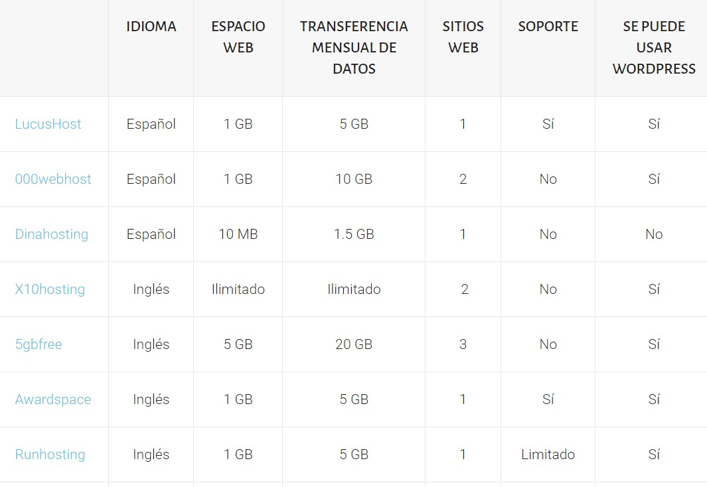

# SUBIR TU PÁGINA A UN HOSTING

### ¿Qué es el Hosting?

El alojamiento web (en inglés web hosting) es el servicio que provee a los usuarios de Internet un sistema para poder almacenar información, imágenes, vídeo, o cualquier contenido accesible vía web. ... Para que un HOSTING pueda utilizar las funciones de acceso web por navegador y e-mails debe tener asociado a un DOMINIO.

### Hosting gratuito

hostings gratuitos
---
https://www.000webhost.com/
